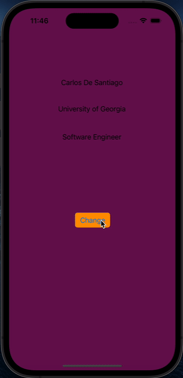

# Prework - *IOS101-Prework*

Submitted by: **Carlos De Santiago**

**IOS101-Prework** is an app that uses labels to display information and a button to change the background of the application.

Time spent: **1** hours spent in total

## Required Features

The following **required** functionality is completed:

- [x] Users are see a screen with three labels and a button
- [x] Tapping the button changes the screen color to a random color
 
## Video Walkthrough

Here's a walkthrough of implemented user stories:

<!-- Replace this with whatever GIF tool you used! -->
GIF created with [Kap](https://getkap.co/) for macOS

## App Brainstorming (Step 4)

Instagram
- User stories
- Explore page

Spotify
- Music recommendations
- Offline listening

Youtube
- Thumbnail previews
- Playlists

App Idea
Food Wheel: One problem I always have is not being able to choose where to eat when I eat out. Food wheel is an app that will help a user choose a random place to eat at. The app will read the user's location and take in a radius to compile a list of places to eat at. The app will then add all the places onto a wheel. The user will tap to spin the wheel which will stop on the randomly selected place. 

## License

    Copyright 2023 Carlos De Santiago

    Licensed under the Apache License, Version 2.0 (the "License");
    you may not use this file except in compliance with the License.
    You may obtain a copy of the License at

        http://www.apache.org/licenses/LICENSE-2.0

    Unless required by applicable law or agreed to in writing, software
    distributed under the License is distributed on an "AS IS" BASIS,
    WITHOUT WARRANTIES OR CONDITIONS OF ANY KIND, either express or implied.
    See the License for the specific language governing permissions and
    limitations under the License.
